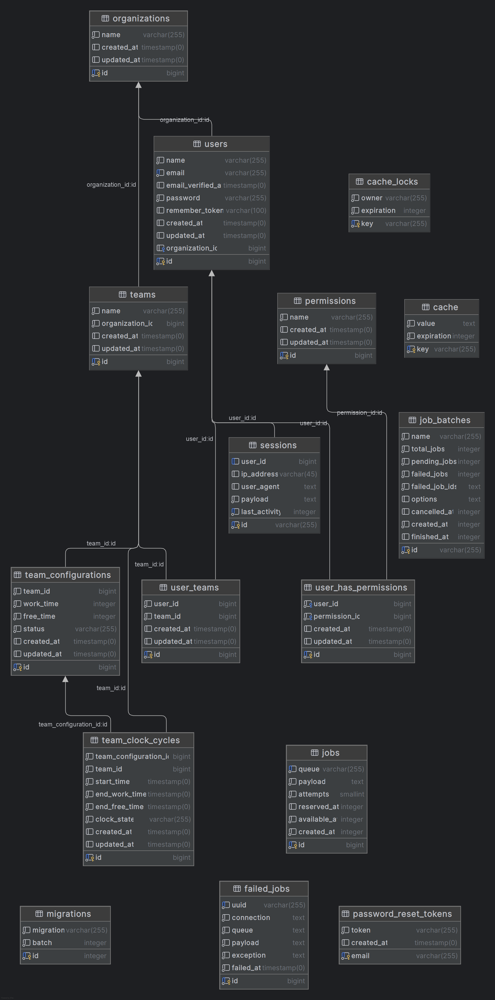
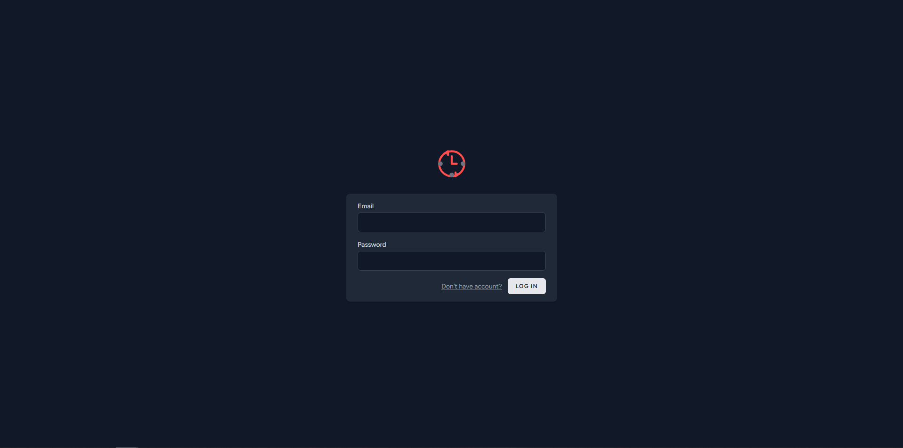
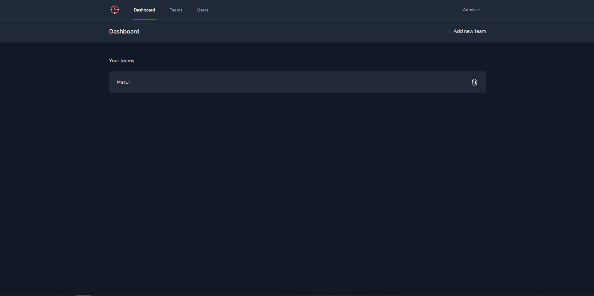
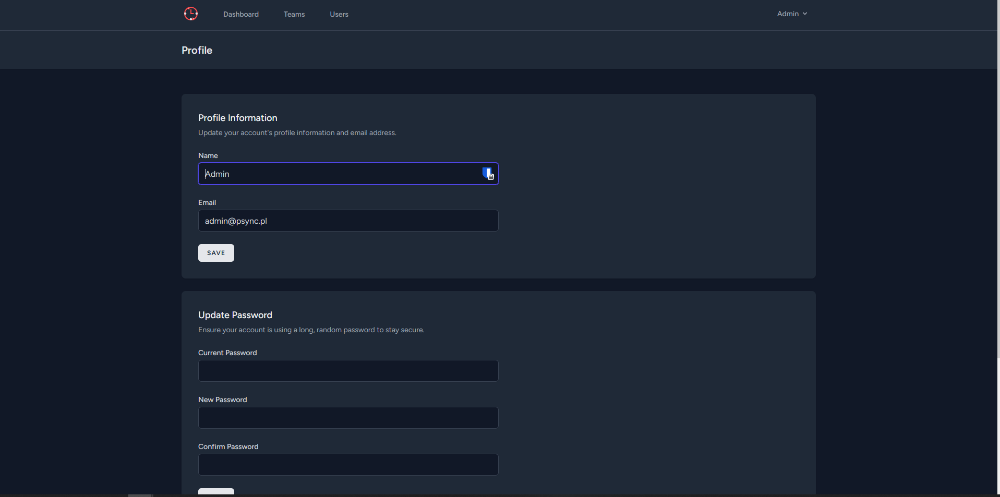
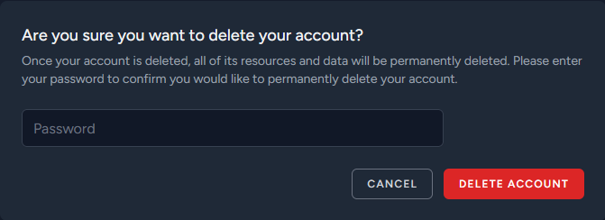
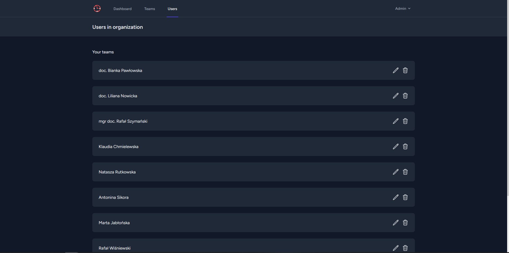
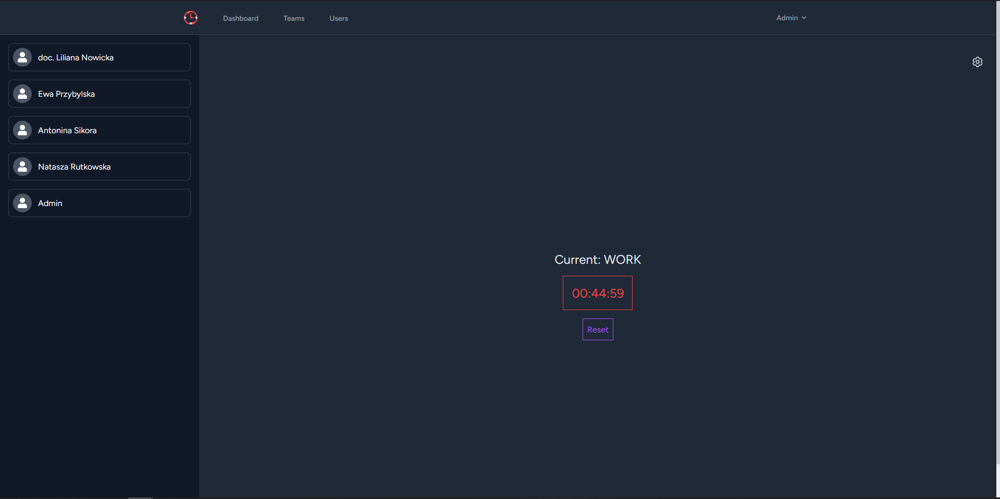

# PSync

PSync - Pomodoro synchronizer for a team. Application helps to manage team focus across all team members.

## Table of contents
* [Installation](#instalation)
* [ERD Diagram](#erd-diagram)
* [User logins](#user-logins)
* [Views](#views)
* [Main functionality](#main-functionality)
* [Troubleshooting](#Troubleshooting)


## Instalation
***Important***

Read the instruction carefully and do all steps in order that are written. In case of any problems see the [Troubleshooting](#Troubleshooting) section. It should contain solves for problems that might occur when installing application.

To run project go to provisioning folder and run 
```
docker compose up -d
```

After that enter container named 'php-psync' using command:
```
docker exec -it {container_id} sh 
```
**Later create .env** in root folder of project file and copy all values from .env.example than run following commands:
```
composer install
php artisan key:generate
php artisan migrate:fresh --seed
npm i
npm run build
```

Application work on port 43001 i.e. after the setup go to localhost:43001
## ERD diagram


## User logins
**Accounts for testing:**
- **Admin Account:**
- **Email:** admin@psync.pl
- **Password:** password
- **Client Accounts:**

Because users are generated via factories and using faker you need to access database to check what emails are in database.

To do that in terminal execute 
```
docker exec -it {postgres_container_id} sh
```
and inside container run 
```
psql -U psync-user -d psync-db
select * from users;
```
Remember to include semicolon when executing query. After that you will be able to list all user emails. All accounts have password: password
## Views
**Login:**


**Dashboard:**


**User profile:**


**Modals:**



**Admin view to manage users:**


**Clock view:**


## Main functionality
The functionality that is the core of the application is synchronized clock across all team members. To check the functionality it is advised to open two
browsers and logged in to different accounts. After that join the same team and check how the clock behaves

## Troubleshooting
**php artisan key:generate throws file_get_contents(/var/www/.env): Failed to open stream: No such file or directory**

.env file probably doesn't exist in project. Create .env file and copy .env.example content to .env file and try again.

**npm i throws npm: not found**

Error caused by not loading scripts to $PATH system variable. Execute command:
```
. ~/.bashrc
```
and try again to install npm packages.
